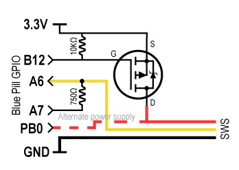
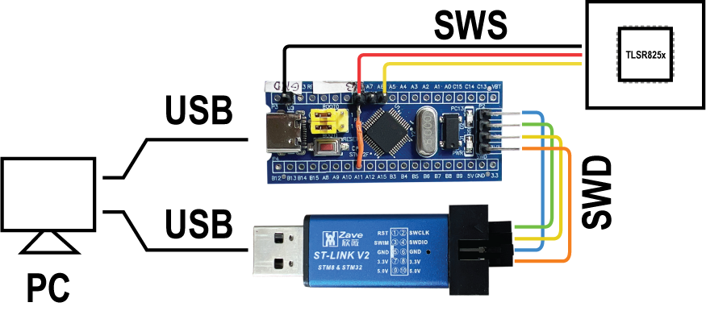
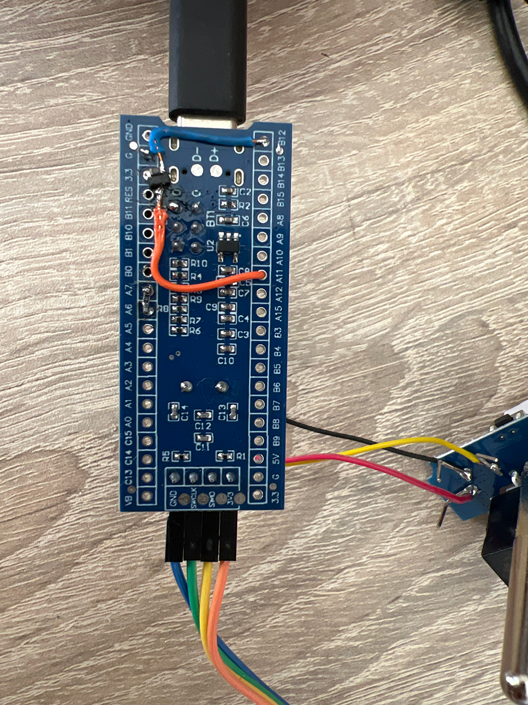
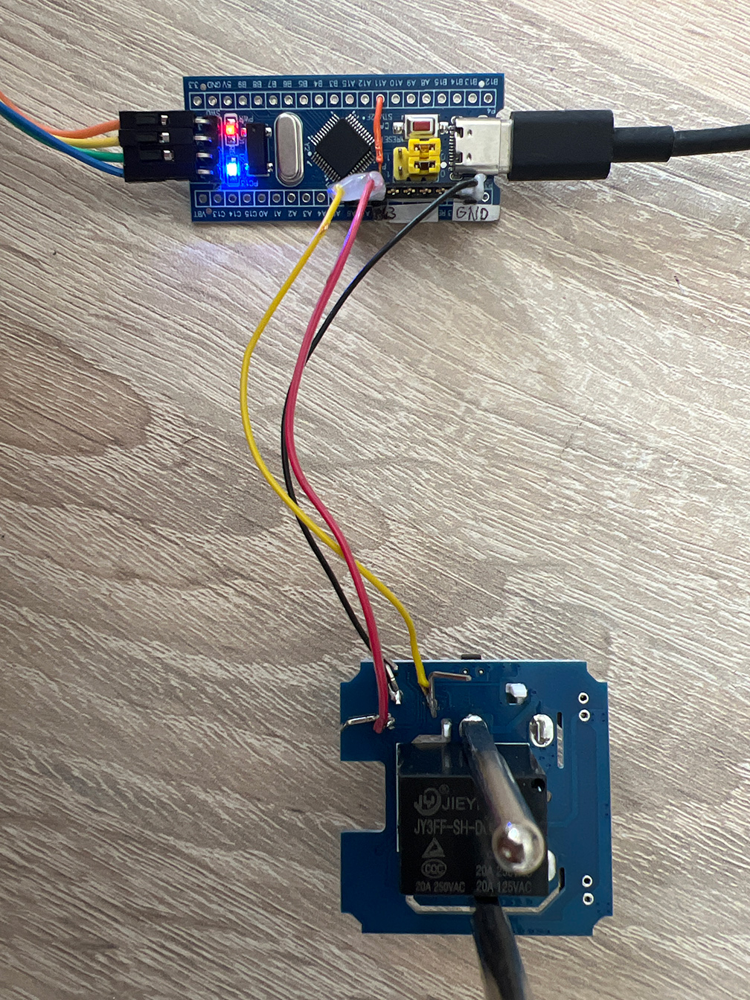
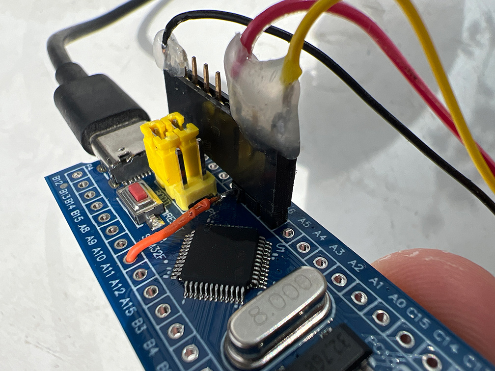
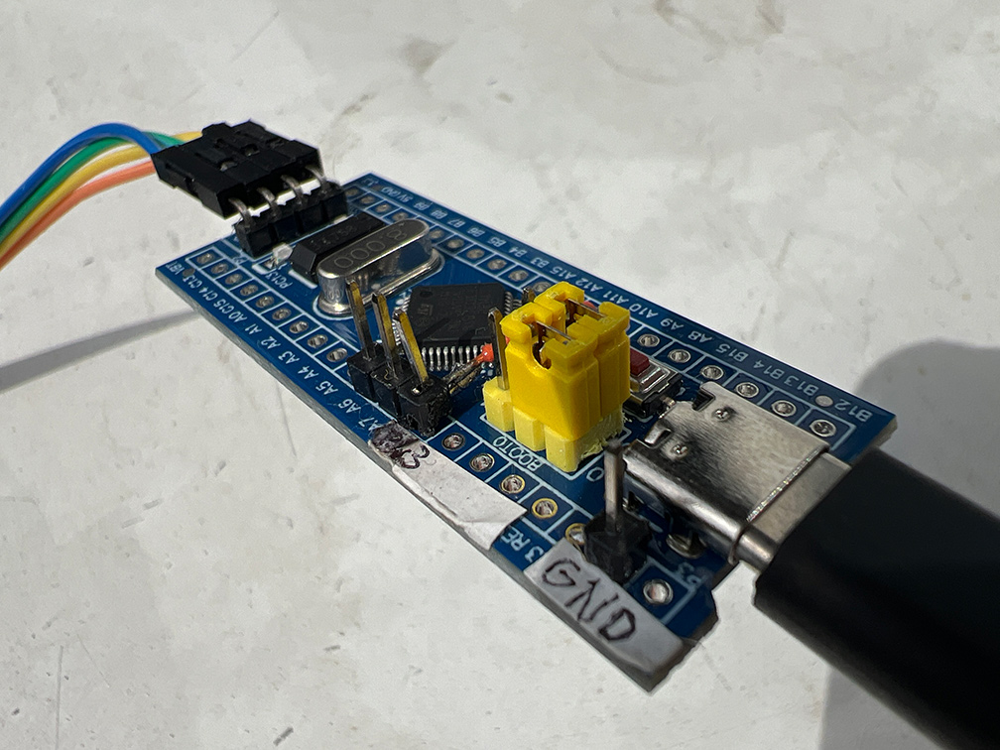
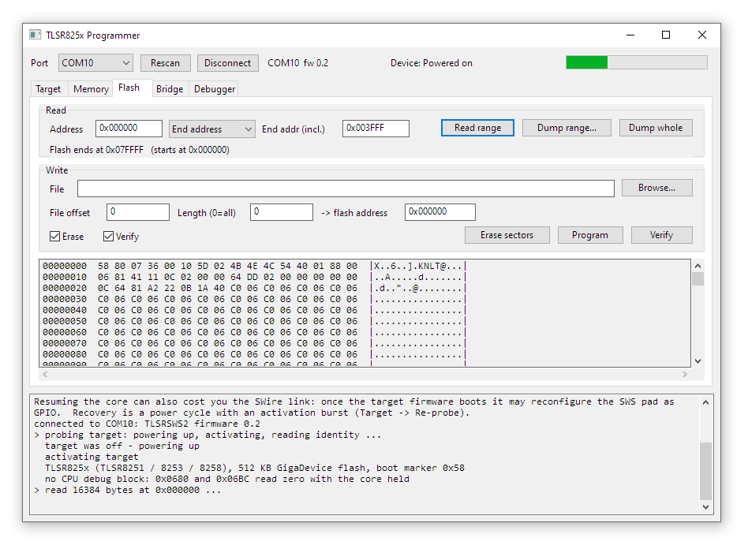

# TLSR825x programmer

An open-source programmer and debugger for Telink TLSR825x chips (TLSR8251 /
8253 / 8258) built from an STM32F103 "Blue Pill", with Windows GUI and CLI
applications written in plain C.

This application allows you to read/write firmware files of Telink TLSR825x chips.
It is a derivative of pvvx's work, but full 512KB flash read takes 20s instead of more than a minute (using TlsrTool.exe), full write takes about 40s instead of almost 2 minutes (erase-flash-verify). The application also includes an integrated debugger, although the usability of it depends on the chip you have. Some chips don't respond to debug commands.

The application accesses the chip using Telink's single-wire **SWire** interface.
This tool is particularly useful to reverse-engineer chinese electronic products, backup or repair firmware files
or flash custom firmware to devices.

## Quick start
This software is Windows native. Other platforms need porting. Nowadays LLMs can do the job easily.

1. Make sure you have ST-Link Utility or STM32CubeProgrammer installed. That way, you can flash you Blue Pill
2. Connect ST-Link to the computer and connect SWD interface to the Blue Pill programming interface.
3. Open the ST-Link Util or Cube Programmer and flash bin/blue-pill-firmware.hex into the STM32F103C8T6.
4. Now you have your Telink Programmer board ready. Connect it over USB to PC and connect GND->GND, 3V3->VCC, A6,A7-> SWS. Schematic is below.
5. Open bin/programmer_gui.exe (or CLI variant). Press Rescan (COMx should be detected). Press Connect. You should see device info and capabilities in the Target tab.
6. Now you can use Memory/Flash tab to perform memory reads/writes.

Example of CLI run:
```
bin\programmer_cli.exe --list
bin\programmer_cli.exe -p COM10 --info
bin\programmer_cli.exe -p COM10 --dump -f backup.bin
```
## Images

The schematic of the Blue Pill circuitry. You have two options how to wire it all up.
The minimal one, which consists of a GND->SWS_GND, PB0->SWS_VCC, A7->\[750R\]->A6, A6->SWS_SWS

and the more complex one where you wire up a MOSFET to SWS_VCC. The MOSFET is controlled by B12. Both pins are controlled at the same time, so any of the two will work out of the box. MOSFET version gives you the ability to drive more demmanding targets across demmanding operating modes.



This is the block diagram of the whole setup:



Example of wiring up the MOSFET and A7<->A6 resistor (1K works as well):



Example of wiring up a Tuya outlet through the SWS interface:







The GUI looks like this:



## Repository content

| Folder | Contents |
|---|---|
| `blue-pill-firmware/` | Firmware that makes Blue Pill act as a Telink programmer. |
| `bin/` | Ready to use firmware and control software (CLI and GUI) |
| `driver/` | STMicroelectronics USB CDC driver, in case the Blue Pill firmware is not recognised by Windows. |
| `programmer-app-cli/` | Contains common logic shared with GUI part and CLI interface. |
| `programmer-app-gui/` | The Win32 GUI, with the core from CLI part. |

The protocol core (`tlsr_serial.c`, `tlsr_bridge.c`, `tlsr_flash.c`,
`tlsr_debug.c`, `tlsr_core.h`) lives in the CLI folder and is shared by both
applications, so a fix to the SWire, flash or debug logic reaches both. The two
front ends offer the **same feature set** — anything the GUI can do has a CLI
switch, and the reverse — because both are thin layers over that one core.

`bin/` is the only folder that holds binaries built from this tree. Both
Makefiles link straight into it and keep their objects in a `build/`
subdirectory, so a published binary can never be older than its source. (The
two `.exe` files in `driver/` are STMicroelectronics' redistributable
installer and have to sit next to `stmcdc.inf`; they are not built here.)

## CLI and GUI feature set

| GUI | CLI |
|---|---|
| Port combo, **Rescan**, **Connect** | `--list`, `-p PORT` |
| Target -> **Re-probe** | `--info` (and `--dbg-probe`) |
| Target -> **Power on / off**, rail selector | `--power on\|off`, `--rail` |
| Target -> **Halt core** / **Run core** / **Reset+run** | `--halt` / `--run` / `--reset` |
| Memory -> **Read**, region and address/length | `--read --region --addr --length` |
| Memory -> **Save** | `--read -f FILE` |
| Memory -> **Write** | `--write "HEX"` |
| Flash -> **Read** / **Dump** / **Erase** | `--read --region flash` / `--dump` / `--erase` |
| Flash -> **Program** / **Verify**, offset + length + address | `--flash` / `--verify`, `--offset -n -a` |
| Bridge -> **Self-test** / **Pin test** | `--selftest` / `--pintest` |
| Bridge -> **Activate**, activation frames | `--activate --frames N` |
| Bridge -> **Refresh** / **Apply** timing | `--cfg` / `--set-cfg K=V,..` |
| Debugger -> **Continue** / **Pause** / **Stop** / **Restart** | `--continue` / `--stall` / `--halt` / `--reset` |
| Debugger -> **Step into**, **Step instruction** | `--step [N]` |
| Debugger -> **Step over** / **Step out** | `--step-over` / `--step-out` |
| Debugger -> **Run to cursor** | `--runto ADDR --timeout MS` |
| Debugger -> **Toggle** / **Clear breakpoint** | `--bp ADDR` / `--bp off` |
| Debugger -> **Refresh registers** | `--regs` |


or start `bin\programmer_gui.exe`, pick the port and press **Connect**.

Always take a backup with `--dump` before writing anything.

## Building

Both applications need only MinGW-w64 and the Win32 API:

```
cd programmer-app-cli  && mingw32-make      ->  ../bin/programmer_cli.exe
cd programmer-app-gui  && mingw32-make      ->  ../bin/programmer_gui.exe
```

`mingw32-make clean` in either folder removes that folder's `build/` and leaves
`bin/` alone.

The firmware needs `arm-none-eabi-gcc`:

```
cd blue-pill-firmware  && make              ->  firmware.bin / firmware.hex
cd blue-pill-firmware  && make test         ->  native unit tests for the codec
```

## Protocol notes

The SWire details were recovered with a logic analyser from a working session,
because the public write-ups disagree with what this silicon actually does. The
essentials:

* A cell is 7 time units; `'0'` is 2 units low then high, `'1'` is 5 units low.
* Every byte — master **and** slave — is 10 cells: a command bit, 8 data bits
  MSB first, and an end cell.
* A frame is `START(0x5A) | address[3] | RW(0x00 write / 0x80 read) | data… |
  STOP(0xFF)`.
* **A read must be clocked by the master:** for each response byte it drives
  that byte's first cell as a `'0'` and releases the wire for the remaining
  nine. Leave the window idle and the target never answers at all.
* The target replies on **its own oscillator**, so a decoder must derive its
  threshold from the slave's observed cell period, and must sample fast enough
  not to alias its short pulses.
* Flash access through the MSPI controller needs the RD bit set before reading,
  the first byte discarded as stale, and each burst kept to one SWire frame.

`blue-pill-firmware/swire_codec.h` documents the format in full.

**Also worth knowing:** SWire reads are only trustworthy with the core stopped.
With it running, bytes come back bit-shifted — the `0x007E` chip id itself
does — so anything read in that state is noise. And once the Tuya firmware
boots it may reconfigure the SWS pad as GPIO, which costs the link until a
power cycle plus an activation burst.

## Licence and credits

GPL-2.0-only. See `LICENSE`.

The protocol knowledge came from pvvx's Telink tooling
(<https://github.com/pvvx/TlsrTools825x>, <https://github.com/pvvx/TLSRPGM>) —
in particular the idea of generating the SWire waveform with SPI + DMA and the
PA6 / PA7 / 750 Ω arrangement — along with `rbaron/m6-reveng` and the
"Telink swire on the wire" writeup at hacst.net. The code here is an
independent implementation; the debt is in the understanding, and it is
gratefully acknowledged.
